# Unathi Sprite Parity — Port Checklist

Sprite-by-sprite comparison of **SS13 Paradise Unathi** against **SS14 Reptilian**, so you can
tick off what needs porting.

- **SS13 source:** `Paradise/icons/mob/sprite_accessories/unathi/*.dmi`
- **SS14 source:** `Resources/Textures/Mobs/Customization/reptilian_parts.rsi/`
- Previews are the **south-facing** cell only, auto-cropped to content and scaled 4×.
  Checkerboard = transparency. These are greyscale masks; the game tints them.

**Status key** — ✅ SS14 already has it · ⚠️ probable match, eyeball it · ❌ missing, needs porting

---

## 1. Horns &amp; Crest

SS13 `unathi_hair.dmi` (16) → SS14 `HeadTop` markings (12)

| SS13 | name | SS14 | name | status |
|:--:|---|:--:|---|---|
|  | `simple_horns` |  | `horns_simple` | ✅ |
|  | `short_horns` |  | `horns_short` | ✅ |
| 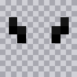 | `curled_horns` |  | `horns_curled` | ✅ |
| 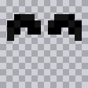 | `ram_horns` | 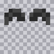 | `horns_ram` | ✅ |
| 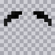 | `ram2_horns` | 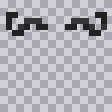 | `horns_argali` | ⚠️ |
| 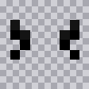 | `drac_horns` | 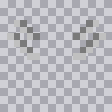 | `horns_double` | ⚠️ |
| 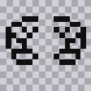 | `cobrahood` | 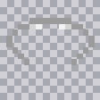 | `frills_hood_primary` | ⚠️ |
| 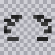 | `cobrahood_webbing` | 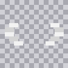 | `frills_hood_secondary` | ⚠️ |

### To port

- [ ] 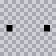 `lower_horns` — small low studs
- [ ] 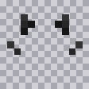 `big_horns` — scattered brow spikes
- [ ] 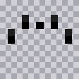 `small_horns` — fine brow row
- [ ] 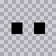 `chin_horns` — paired chin blocks
- [ ] 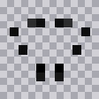 `adorns_horns` — ring of studs
- [ ] 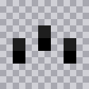 `spikes_horns` — triple crest spikes
- [ ] 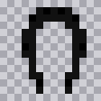 `hipbraid` — hooded braid
- [ ] 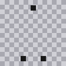 `hipbraid_beads` — braid beads (secondary layer)

---

## 2. Frills / Jaw

SS13 `unathi_facial_hair.dmi` (14) → SS14 `HeadSide` markings (9)

SS13 pairs each design with a `_webbing` variant — that is the same split as SS14's
`_primary` / `_secondary` two-tone markings, so port them together.

| SS13 | name | SS14 | name | status |
|:--:|---|:--:|---|---|
| 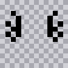 | `aquaticfrills` | 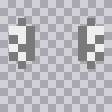 | `frills_aquatic` | ✅ |
| 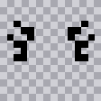 | `shortfrills` | 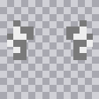 | `frills_short` | ⚠️ |
| 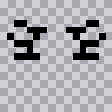 | `longfrills` | 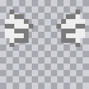 | `frills_big` | ⚠️ |
| 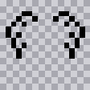 | `sidefrills` | 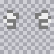 | `frills_simple` | ⚠️ |

### To port

- [ ]  `longspines` + 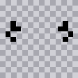 `shortspines`
- [ ] 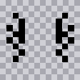 `dracfrills` + 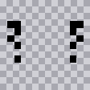 `dracfrills_webbing`
- [ ] 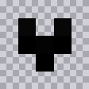 `dorsalfrills` + 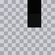 `dorsalfrills_webbing`
- [ ] Webbing layers for any ⚠️ match you accept above:
      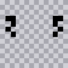 `aquaticfrills_webbing` ·
       `shortfrills_webbing` ·
      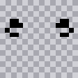 `longfrills_webbing` ·
      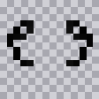 `sidefrills_webbing`

---

## 3. Head &amp; Face Markings

SS13 `unathi_head_markings.dmi` (10) → SS14 `Head` + `Snout` markings

**This is the biggest gap.** SS14's `Head` layer has exactly one marking (`head_tiger`);
the rest of its head art is snout shapes, which cover only 3 of the 10 SS13 designs.

| SS13 | name | SS14 | name | status |
|:--:|---|:--:|---|---|
| 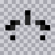 | `tigerhead` | 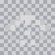 | `head_tiger` | ✅ |
|  | `snoutsharp` | 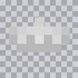 | `snout_sharplight` | ⚠️ |
| 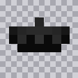 | `snoutround` |  | `snout_roundlight` | ⚠️ |
| 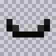 | `lowersnout` | 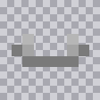 | `snout_splotch_primary` | ⚠️ |

### To port

- [ ] 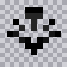 `bandedface` — banded muzzle stripes
- [ ] 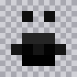 `facenarrow` — narrow mask
- [ ]  `facesharp` — sharp mask
- [ ] 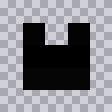 `pointsface` — blocked muzzle
- [ ]  `sharptiger` — tiger, sharp snout
- [ ] 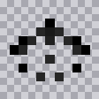 `tigerface` — tiger, face only

> **Correction:** an earlier draft of this file said `Head: limit 1` had to be raised or "only one
> will ever be selectable". That was wrong. `MarkingsLimits.Limit` is *"How many markings this
> layer can take"* — i.e. how many a character may wear **at once**, not how many exist in the
> catalogue. With `limit: 1` you still pick freely from all head markings; you just cannot stack
> two. That matches Paradise, which also allows one head marking, so the limit is left alone.

---

## 4. Body Markings

SS13 `unathi_body_markings.dmi` (4) → SS14 `Chest` markings (4)

| SS13 | name | SS14 | name | status |
|:--:|---|:--:|---|---|
| 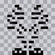 | `banded` | 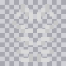 | `body_tiger` | ✅ |
| 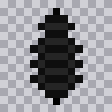 | `belly` | 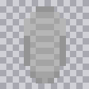 | `body_underbelly` | ✅ |

### To port

- [ ] 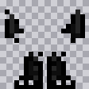 `points` — dark limb points
- [ ] `stripe` — **preview renders blank**; the south cell is empty. Open the DMI directly
      before deciding whether there is anything to port.

---

## 5. SS14-only — nothing to do

These have no Paradise counterpart. Listed so nobody tries to "fix" them by removing them,
and so you know what a Paradise player gains by moving to your fork.

**Horns (7):** `horns_angler` `horns_ayrshire` `horns_bighorn` `horns_demonic` `horns_myrsore`
`horns_kobold_ears` `horns_floppy_kobold_ears`

**Frills (3):** `frills_axolotl` `frills_divinity` `frills_neckfull`

**Snouts (2):** `visage_round` `visage_sharp`

**Body (2):** `body_backspikes` `body_fin`

**Limbs (4):** `l_arm_tiger` `r_arm_tiger` `l_leg_tiger` `r_leg_tiger` — Paradise has no per-limb layer at all.

**Tails (6 designs × static/behind/front/wagging):** `tail_smooth` `tail_large` `tail_spikes`
`tail_ltiger` `tail_dtiger` `tail_aquatic` — Paradise Unathi have exactly one fixed tail
(`tail = "sogtail"`), not a choice.

---

## Notes

**Blank previews.** 11 previews render as bare checkerboard because their south-facing cell is
genuinely empty: every `tail_*_front` (the front layer only draws when facing away),
`snout_round` / `snout_sharp` (art lives in the `*light` variants), `body_backspikes`,
`body_fin`, and SS13 `stripe`. Not extraction failures.

**Why `_webbing` and `_primary`/`_secondary` matter.** Both engines split two-tone markings into
two sprites so each half can be tinted separately. A Paradise `X` + `X_webbing` pair becomes an
SS14 `X_primary` + `X_secondary` pair — port both halves or the marking will be flat.

**Do not enable the Hair / FacialHair layers.** Reptilian sets `Hair: limit 0` and
`FacialHair: limit 0` deliberately. Paradise stores horns and frills in its *hair* slots because
that slot already existed; SS14 stores the same designs as `HeadTop` / `HeadSide` markings.
Turning those layers on gives Unathi human hairstyles.

**Regenerating these previews.** Scripts live in the session scratchpad:

```bash
node preview.js dmi <file.dmi> <state> <out.png>   # Paradise sheet → preview
node preview.js rsi <file.png>         <out.png>   # SS14 RSI → preview
node dmi2rsi.js  <file.dmi> <state> <out.png>      # full 4-direction extract, RSI layout
```

`dmi2rsi.js` is the one to use for the actual port — it was validated pixel-identical against
`goliath_hide.png` and `lizard_hide.png` already in the repo.

---

**Totals:** 20 sprites definitely need porting (8 horns, 4+ frills, 6 head, 2 body), plus up to 4
webbing layers depending on which ⚠️ matches you accept.
